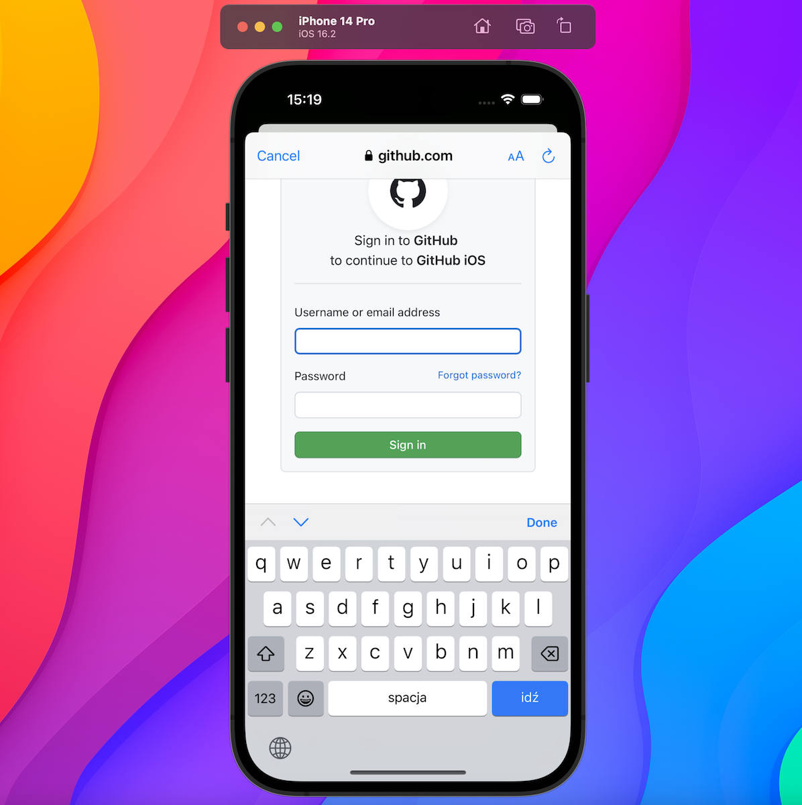
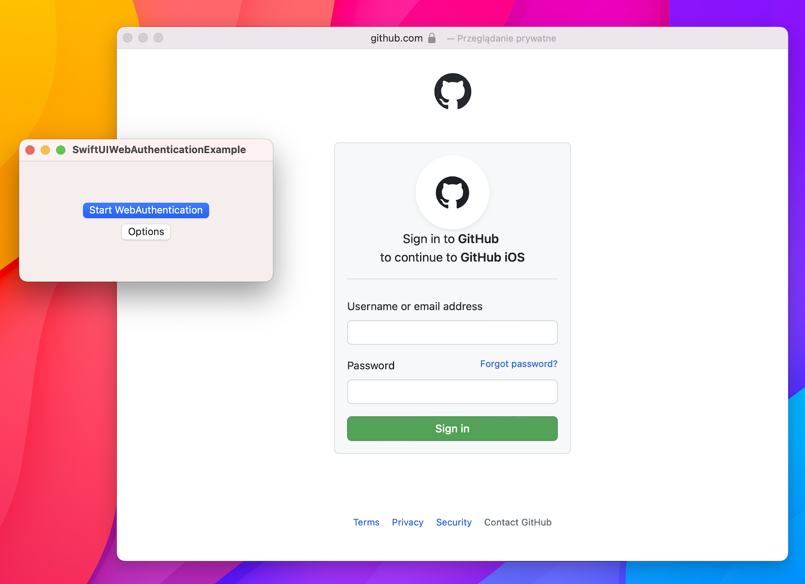

# SwiftUIWebAuthentication

A SwiftUI way to show ASWebAuthentication





### Platforms

```swift
  [.iOS(.v13), .macOS(.v10_15)]
```

## Usage

```swift
import SwiftUI
import SwiftUIWebAuthentication

struct ContentView: View {
  @State private var showWebAuthentication = false

  var body: some View {
    VStack {
      Button("Show WebAuthentication") {
        showWebAuthentication = true
      }
    }
    .webAuthentication(
      isPresented: $showWebAuthentication,
      url: URL(string: "https://github.com/login/oauth/authorize?client_id=\(clientId)"),
      callbackURLScheme: "github"
    ) { result in
      if case .success(let url) = result {
        // handle URL from callback
      }
    }
  }
}
```

## Installation

### Swift Package Manager

To integrate using Apple's [Swift Package Manager](https://swift.org/package-manager/), add the following as a dependency to your `Package.swift`:

```swift
dependencies: [
    .package(url: "https://github.com/kubens/SwiftUIWebAuthentication.git", from: "1.0.0")
]
```

Or navigate to your Xcode project then select `Swift Packages`, click the “+” icon and search for `SwiftUIWebAuthentication`.
